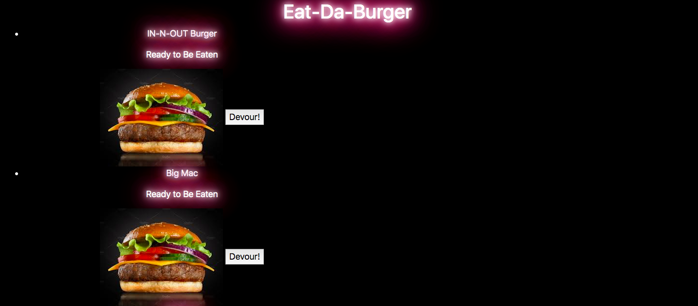

# Burger-App
Simple application that allows users to eat burgers/create burgers

## Project Description
The actual functionality of this app is quite simple, but the deeper purpose of this project was to explore the MVC structure, and experiment with this design. This app includes a public folder for styling, models, controllers, config, etc. 

<a href="https://enigmatic-river-81024.herokuapp.com/" target="_blank">The deployed link is available here</a> 

### Technologies Used

html, css, javascript, jquery, bootstrap, Google Fonts, npm, express, handlebars, sql, jaws_db, mvc model design

#### Additional Notes

Hosted through heroku